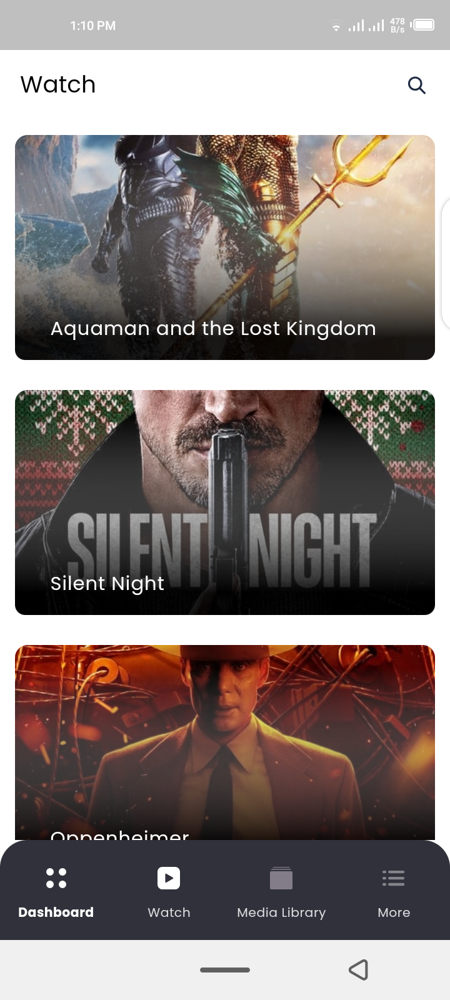
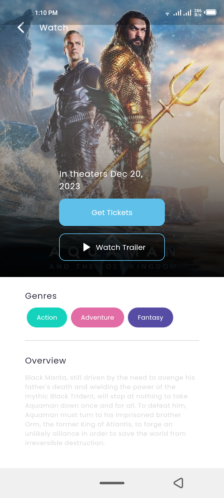
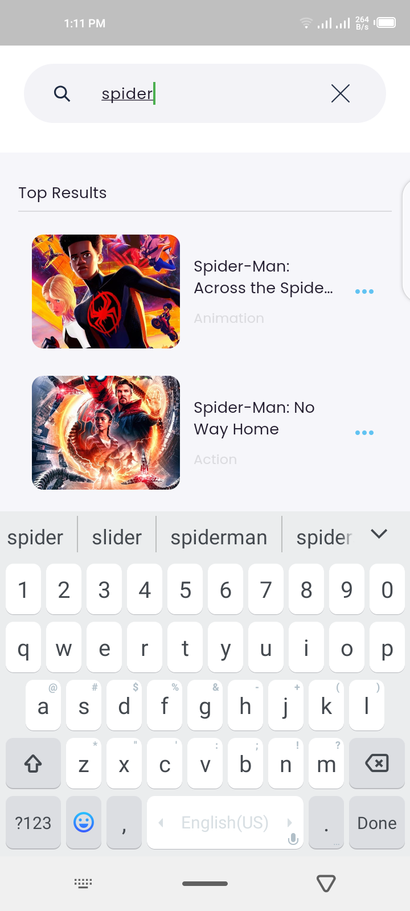
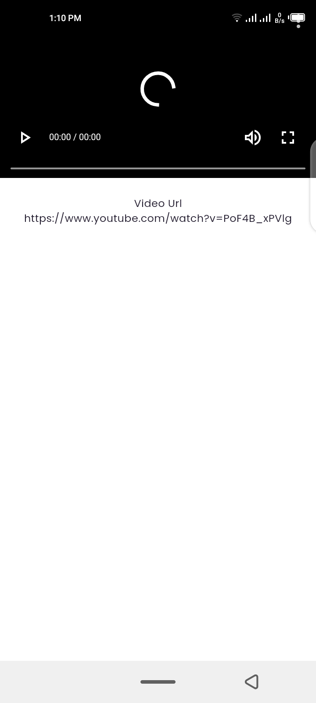
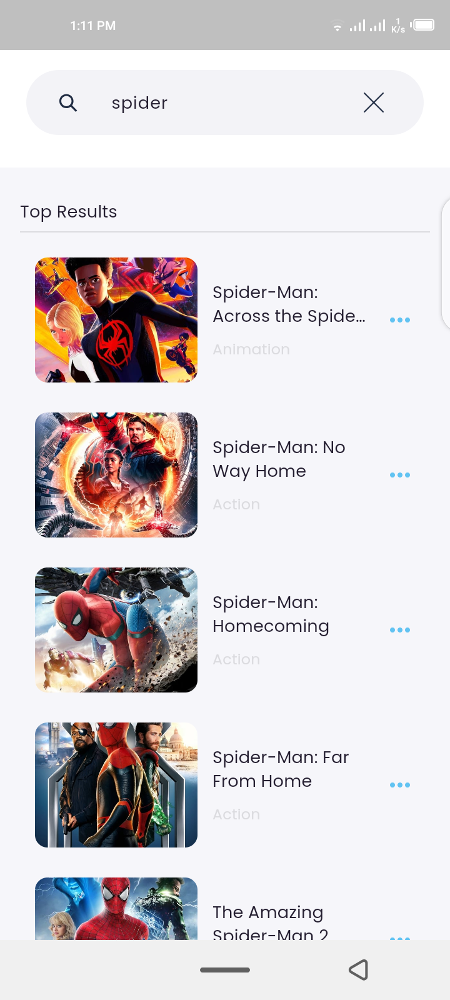
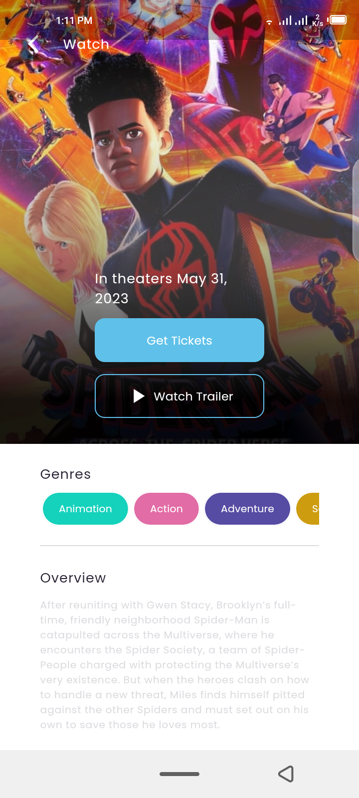
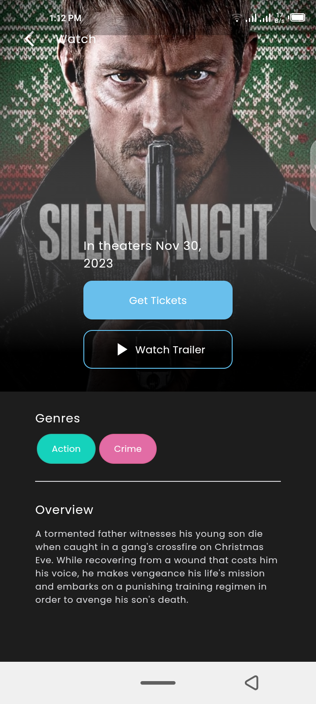
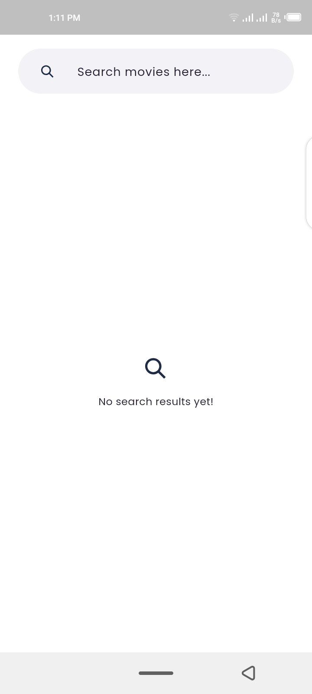
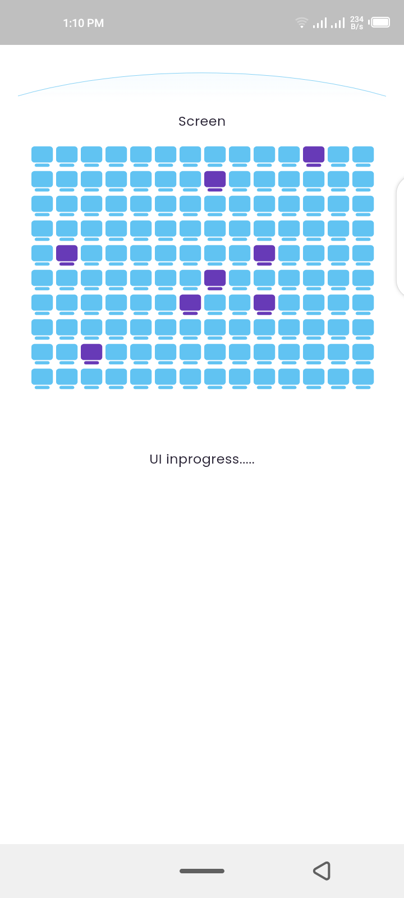

# TenTwenty Assignment

A new Flutter project.

## Getting Started

## How to Use

**Step 1:**

Download or clone this repo by using the link below:

```
https://github.com/alihaider78222/flutter-mobx-boilerplate-project
```

**Step 2:**

rename ```.env-copy``` to ```.env``` and add your API and Access Token.

## Screenshots

<p float="left">
  








</p>

<br>


## Release / APK

apk available in ```Releases``` section, download now to browse around.

## Easy Localization for translation

run these command in terminal to generate local keys which can be used in app

```flutter pub run easy_localization:generate --source-dir ./assets/langs```

```flutter pub run easy_localization:generate -S assets/langs -f keys -o locale_keys.g.dart```
